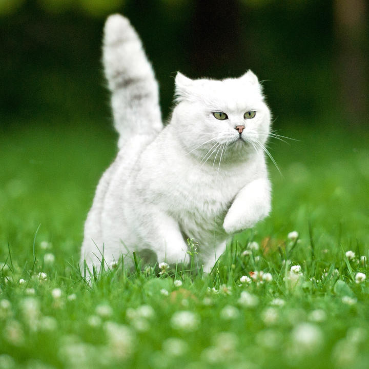
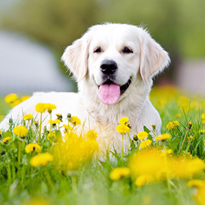
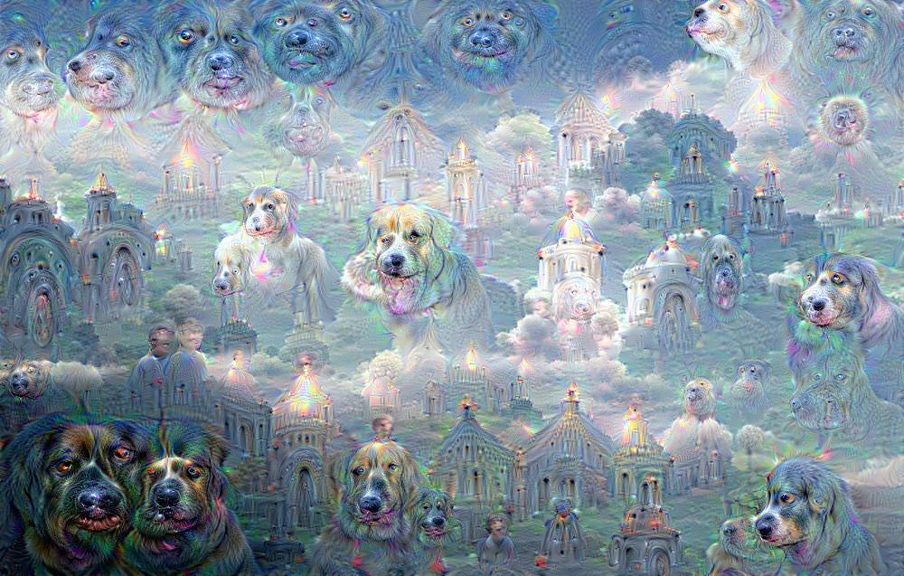

# Codebyte156 - DeepLearning CNN Image Recognition Project 

Classifier for images or video input using **Google TensorFlow**. 
Research project on Convolutional Neural Networks, feature extraction, transfer learning, adversary noise and *DeepDream*. 

The notebooks from 01 to 07 are referred from Gaetano Bonofiglio Kidel.
In notebooks from 01 to 03, mainly followed with references and documentations, with some changes and observations, in order to learn how to use TensorFlow to build Convolutional Neural Networks for OCR and image recognition. Later notebooks follow the project specifications, while notebooks 06 and 07 were used for some more facoltative observations. 

## Keras
Keras subfolder contains more advanced experiments done with Keras. The first 4 notebooks are about MNIST, with single column and multi column CNNs and dataset expansion. Notebook 5 is an implementation of Transfer Learning using Keras with CIFAR-10.

## Libraries and credits
* Notebooks from 01 to 05 (included) use TensorFlow 0.9.0, Notebook 06 uses TensorFlow 0.11.head. 
* Notebooks 03 and 04 use PrettyTensor 0.6.2.
* Notebook 07 uses caffe library and some modified code from [google/deepdream](https://github.com/google/deepdream).
* Notebooks in Keras subfolder use Keras and TensorFlow 0.12.1
* Special thanks and credits to [Hvass-Labs](https://github.com/Hvass-Labs) for well made tutorials and libraries. 
* Notebooks were made on 3 different Docker machines running different environments, thanks to [jupyter/docker-stacks](https://github.com/jupyter/docker-stacks/tree/master/tensorflow-notebook) and [saturnism/deepdream-docker](https://github.com/saturnism/deepdream-docker).


# DeepLearning-CNN-Image-Recognition

A project demonstrating the use of Convolutional Neural Networks (CNNs) for image and video classification, utilizing TensorFlow. This repository includes multiple experiments such as transfer learning, adversarial noise generation, and DeepDream visualization.

## Table of Contents

1. [Introduction](#introduction)
2. [Features](#features)
3. [Installation](#installation)
4. [Usage](#usage)
5. [Project Structure](#project-structure)
6. [Results](#results)
7. [Contributing](#contributing)
8. [License](#license)

---

## Introduction

Convolutional Neural Networks (CNNs) have revolutionized the field of computer vision. This project leverages CNNs to:

- Perform image and video classification.
- Experiment with advanced techniques like transfer learning and adversarial examples.
- Visualize model activations using DeepDream.

The repository provides a step-by-step implementation of these methods, making it an excellent resource for beginners and enthusiasts.

---

## Features

- **Image Classification**: Train CNNs to classify images into various categories.
- **Transfer Learning**: Utilize pre-trained models (like Inception) for feature extraction and fine-tuning.
- **Adversarial Noise**: Generate adversarial examples to test model robustness.
- **DeepDream**: Create visually stunning images by maximizing activations in specific layers of the network.

---

## Installation

Follow these steps to set up the project:

1. Clone the repository:
   ```bash
   git clone https://github.com/codebyte156/DeepLearning-CNN-Image-Recognition.git
   ```

2. Navigate to the project directory:
   ```bash
   cd DeepLearning-CNN-Image-Recognition
   ```

3. Install dependencies:
   ```bash
   pip install -r requirements.txt
   ```

4. (Optional) Set up a virtual environment:
   ```bash
   python -m venv venv
   source venv/bin/activate  # On Windows, use `venv\Scripts\activate`
   ```

---

## Usage

1. Train a new CNN model:
   ```bash
   python train_model.py --data_path /path/to/dataset --epochs 10 --batch_size 32
   ```

2. Perform transfer learning:
   ```bash
   python transfer_learning.py --model inception --data_path /path/to/dataset
   ```

3. Generate adversarial noise:
   ```bash
   python adversarial_noise.py --image_path /path/to/image.jpg
   ```

4. Visualize DeepDream:
   ```bash
   python deepdream.py --image_path /path/to/image.jpg
   ```

---

## Project Structure

```
DeepLearning-CNN-Image-Recognition/
├── data/                      # Dataset storage
├── models/                    # Trained models
├── scripts/                   # Utility scripts
│   ├── train_model.py         # Training script
│   ├── transfer_learning.py   # Transfer learning script
│   ├── adversarial_noise.py   # Adversarial noise script
│   ├── deepdream.py           # DeepDream script
├── results/                   # Output results
├── requirements.txt           # Python dependencies
└── README.md                  # Project documentation
```

---

## Results

### Example Classifications

| Input Image       | Predicted Class | Confidence |
|-------------------|-----------------|------------|
|  | Cat             | 95%        |
|  | Dog             | 92%        |

### Adversarial Examples

Original vs. Perturbed Images:

| Original Image    | Adversarial Image |
|-------------------|-------------------|
|  |  |

### DeepDream Visualizations



---

## Contributing

We welcome contributions! To contribute:

1. Fork the repository.
2. Create a new branch:
   ```bash
   git checkout -b feature-name
   ```
3. Commit your changes:
   ```bash
   git commit -m "Add feature"
   ```
4. Push to the branch:
   ```bash
   git push origin feature-name
   ```
5. Open a pull request.

---

## License

This project is licensed under the MIT License. See the [LICENSE](LICENSE) file for details.

---

## Contact

For questions or feedback, please reach out via [GitHub Issues](https://github.com/codebyte156/DeepLearning-CNN-Image-Recognition/issues).
